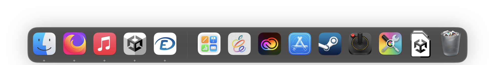

# AltDirecte

AltDirecte est un client desktop (Windows/macOS) pour École Directe.
Il vous permet de consulter vos notes, vos devoirs et bien plus directement dans une application Windows 10/11 et macOS

Pour suivre le développement : [Voir le développement](https://github.com/ArtOS-Developper/AltDirecte/blob/main/Updates/altdirecte-futureversions.md) 

  

## Information Importante
Chaque établissement met en place des "modules" pour permettre d'accéder votre emploi du temps/cahier de texte/badge de cantine et autres. Si votre établissement a désactivé le cahier de texte par exemple, il se peut que AltDirecte plante ou donne une erreur 403. Pensez à vérifier si le module auquel vous tentez d'accéder est bien disponible sur le site d'EcoleDirecte. AltDirecte supportera l'affichage des modules plus tard. De plus si vous rencontrez une erreur avec votre compte et établissement, c'est surement, car je ne peux pas tester tous les cas possibles (je n'ai pas d'autres comptes que celui de mon établissement). Aussi, quand je n'aurai plus mon compte, AltDirecte sera en pause. Si vous êtes développeur, et que vous possédez un compte EcoleDirecte, forkez le projet et maintenez-le ! Je pourrai implémenter dans AltDirecte vos meilleures modifications

## Sortie de l'app

  

  <a>L'application pour macOS Sortira le 27 février 2023 à 8:15. Pour consulter la liste des fonctionnalités qui seront disponibles, rendez-vous</a>
<a href="url">ici</a>

  <a>Pour ce qui est de la version Windows, je n'arrive pas à corriger les problèmes de performances de l'app. Je vais donc la refaire avec une techno plus récente. J'ajouterai des infos d'ici à la mi-mars</a>

## Technologie utilisée
### Windows
J'ai utilisé pour la version v1.x.x le WinForm (je vais devoir changer, car cette techno n'est plus supportée, c'est pour cela que la v2 sera refaite à partir de zéro)

### macOS
Pour l'appli macOS, celle-ci sera faite avec le SDK de macOS et Swift. Ce sera ma première application macOS en Swift, un langage que je ne connais pas beaucoup. Cela risque de prendre du temps de porter AltDirecte sous macOS
## Sugestion d'idée
Si vous avez des idées d'ajout pour AltDirecte faites-moi en part dans la section issues. Je les lirais toutes pour ajouter des fonctionnalités utiles

## Les bugs
Si vous rencontrez des bugs avec l'application, rendez-vous dans les issues pour m'en faire part. C'est grâce à vous que je peux améliorer mon application.

## Sources
### Code source Windows
Le code source ne sera disponible qu'à partir de la version 2.x.x, car elle sera entièrement recodée en WinUI ou WFP pour améliorer de design et la fluidité

### Code source macOS
Le code source macOS sera disponible dans une future branche #macOS-beta quand l'application sortira en version bêta pour macOS.

## Build form sources
### Windows (v1.x.x)
Pour build l'application (en version 1.x.x) sous Windows, il vous faut :
- Le code (Avec le bouton "Code" > "Download as zip" / ou en fessant un clone avec un client Git)
- .Net Framework 4.8
- Visual Studio 2022 avec le module "Développement .Net Desktop" (Visual Studio 2019 avec le même module est peut-être supporté, je n'ai pas essayé)

### macOS (v1.x.x)
Pour build l'application (en version 1.x.x) sous macOS, il vous faut :
- Le code (Avec le bouton "Code" > "Download as zip" / ou en fessant un clone avec un client Git)
- Xcode 14.2 (version que j'utilise pour développer. Doit surement fonctionner avec Xcode 12.5 pour macOS Big Sur 11)

## Remerciments
Merci à [MaitreRouge](https://github.com/MaitreRouge/) pour aide sur le repo [Ecoledirecte-Api-Docs](https://github.com/EduWireApps/ecoledirecte-api-docs) et la team [EduWireApps](https://github.com/EduWireApps) pour leur travail sur [yNotes](https://github.com/EduWireApps/ynotes) qui m'a permis de comprendre en partie comment fonctionne l'API d'EcoleDirecte.x
