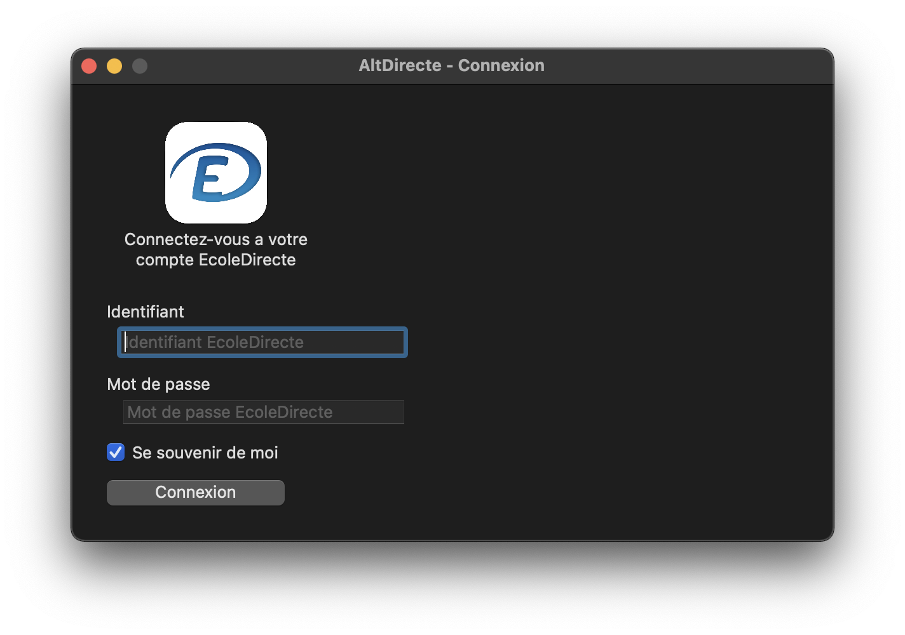

# AltDirecte

AltDirecte est un client desktop (macOS uniquement pour le moment) pour École Directe.
Il vous permet de consulter vos notes, vos devoirs et bien plus directement dans une application

Note : AltDirecte ne sera plus mis a jour. La derniere version est la v1.0.2 pour macOS. AltDirecte sera implémenté dans une suite de logiciels pour les étudiants.

Pour suivre les nouvelles fonctionalitées : [Voir le développement](https://github.com/RetroAndDev/AltDirecte/projects?query=is%3Aopen) 

  

## Modules disponibles
Chaque établissement peux activer ou non différentes fonctionnalitées de EcoleDirecte, si votre établissement a désactivé la Vie Scolaire par exemple, le module ne sera pas listé dans AltDirecte. Au contraire si un des modules n'est pas disponible dans mon établissement (donc non supporté par AltDirecte) il ne sera pas affiché dans AltDirecte. Voici la liste des modules supporté pour le moment (v1.0.2) :
 - [x] Timeline
 - [x] Emploi du temps
 - [x] Notes
 - [ ] Vie Scolaire
 - [x] Cahier de texte
 - [x] Messagerie
 - [ ] Cloud
 - [ ] Espaces de travails
 - [ ] Modules URL (Impala, ou ONISEP Services par exemple)
 - [x] Documents

Le code source macOS sera disponible lors de la sortie en v2.0.0

## Remerciments
Merci à [MaitreRouge](https://github.com/MaitreRouge/) pour aide sur le repo [Ecoledirecte-Api-Docs](https://github.com/EduWireApps/ecoledirecte-api-docs) et la team [EduWireApps](https://github.com/EduWireApps) pour leur travail sur [yNotes](https://github.com/EduWireApps/ynotes) qui m'a permis de comprendre en partie comment fonctionne l'API d'EcoleDirecte.x
