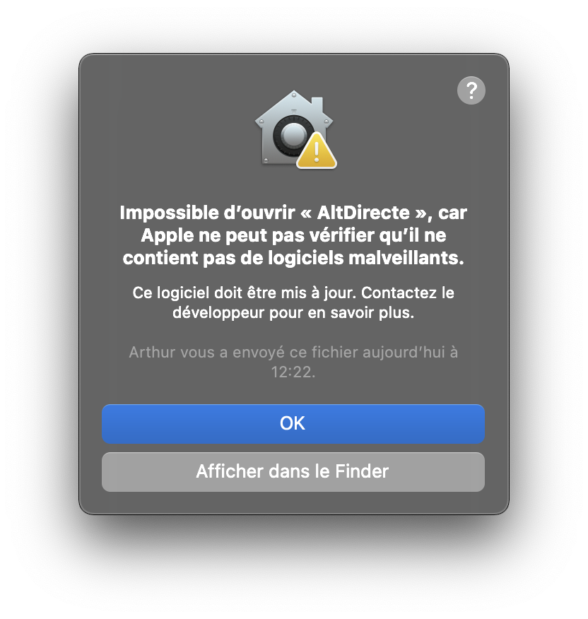
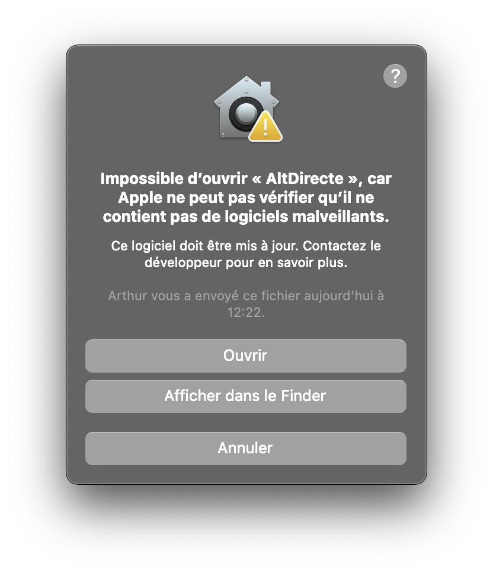

# Installer AltDirecte sur Mac
Pour installer AltDirecte sur un mac, il faut déjà télécharger la dernière version disponible.

Note : AltDirecte est de type "Universel", c'est-à-dire que l'application est utilisable sur un Mac équipé d'un processeur Intel et des puces Apple Sillicon (M1 ou M2 par exemple)

AltDirecte pour mac se présente sous la forme d'un fichier .ZIP. Celui-ci est un fichier compressé contenant l'application au format .APP. 

Après avoir décompressé le fichier .ZIP téléchargé, vous obtiendrez un fichier nommé AltDirecte.app. Celui-ci est à déplacer dans le dossier Applications de votre mac.

### 1. Localiser le dossier "Applications"
Le dossier "Applications" se trouve à l'emplacement `/Applications`
Pour accéder à celui-ci. Ouvrez une nouvelle fenêtre Finder. Rendez-vous dans le menu `Aller > Applications`, si celui-ci n'est pas disponible, utilisez la fonction Aller au dossier `Aller > Aller au dossier...` et entrez le chemin `/Applications`

### 2. Approuvez l'application
MacOS est pénible avec les applications tierces, pour ouvrir une application téléchargée depuis internet, il faut d'abord tenter de l'ouvrir normalement, celle fenêtre s'affichera :

Pour la contourner, il faut faire un clic droit sur l'application puis faire `Ouvrir`
Une nouvelle fenêtre s'ouvre pour vous demander si vous voulez vraiment ouvrir l'application. Sélectionnez `Ouvrir`

Après cela, l'application AltDirecte est correctement installée et vous pouvez l'utiliser dès présent.
Lorsque qu'une mise à jour est disponible, une boite de dialogue s'affichera et quand vous téléchargerez la mise à jour, elle sera également sous forme de fichier .ZIP et les étapes supérieures seront à refaire avec le fichier de mise à jour qui sera téléchargé dans le dossier `Téléchargements`
